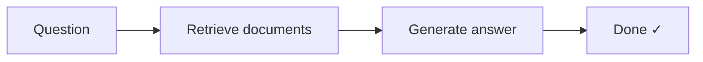
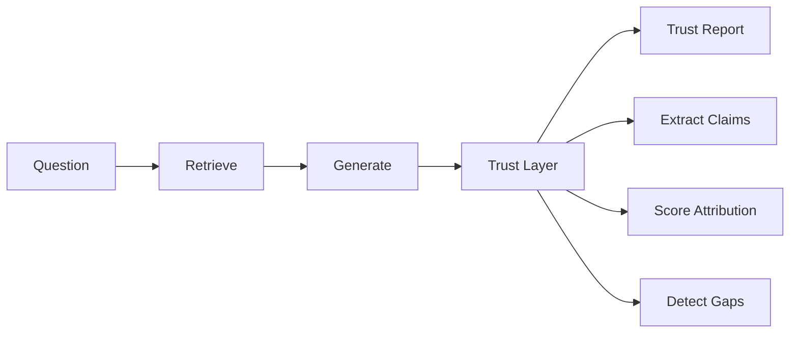
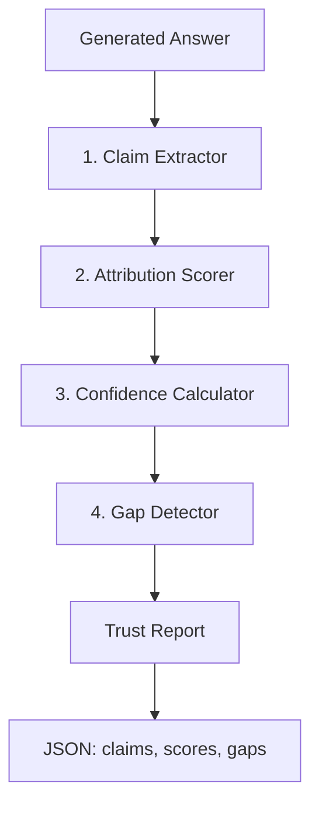

# ApertureMD

**An epistemology layer for medical AI** — transparent evidence attribution, confidence scoring, and knowledge gap detection.

[](https://python.org)
[](https://fastapi.tiangolo.com)
[](https://reactjs.org)
[](LICENSE)

---

## The Problem

Most medical RAG systems do this:



They give you an answer but can't explain:
- **Which evidence** supports which claims?
- **How strongly** does the evidence support the conclusion?
- **What contradicting studies** exist?
- **What don't we know?** What's missing from the evidence?

This opacity is fundamentally incompatible with evidence-based medicine.

---

## The Solution

ApertureMD adds a **Trust Layer** — a post-hoc verification engine that audits every answer:



The output is a **Trust Report** that tells you:
- ✅ What claims were made
- 📊 Which documents support/contradict each claim  
- 🎯 Evidence-based confidence scores (not model logprobs)
- ⚠️ What evidence is missing

---

## Demo

**[→ Try the live demo](https://aperturemd.up.railway.app/)**

*Ask a medical question → Get an answer with transparent evidence attribution*

---

## Key Features

### 🧬 Trust Layer (Core Innovation)

The Trust Layer operates **post-hoc** on the generated answer, decomposing it into verifiable components and scoring each against the retrieved evidence. This is fundamentally different from model logprobs—we're measuring **evidence quality**, not model certainty.

#### 1. Claim Extractor

**Purpose:** Break down the generated answer into atomic, verifiable claims.

**How it works:**
- Uses GPT-4o-mini with structured JSON output to extract claims
- Each claim includes:
  - `text`: The claim itself (e.g., "ACE inhibitors reduce mortality")
  - `span_start` / `span_end`: Character positions in the original answer
  - `cited_pmids`: Associated PubMed citations

**Example:**
```
Answer: "ACE inhibitors reduce mortality in heart failure patients [PMID:12345]. 
         They are typically well-tolerated."

Extracted Claims:
1. "ACE inhibitors reduce mortality" (span: 0-32, pmids: ["12345"])
2. "This applies to heart failure patients" (span: 33-66, pmids: ["12345"])
3. "ACE inhibitors are well-tolerated" (span: 67-102, pmids: [])
```

**Why this matters:** You can't verify a paragraph—you verify individual claims. By extracting claims, we can check each one against the evidence separately.

---

#### 2. Attribution Scorer

**Purpose:** For each claim-document pair, determine if the document **supports**, **contradicts**, or is **neutral** to the claim.

**How it works:**
- Uses GPT-4o-mini to classify each (claim, document) pair
- Three possible verdicts:
  - **SUPPORTS** (+1): Document provides evidence that the claim is true
  - **CONTRADICTS** (-1): Document provides evidence that the claim is false
  - **NEUTRAL** (0): Document mentions related topics but doesn't clearly support/contradict

**Scoring Logic:**
```python
support_score = (supporting - contradicting) / total_docs
# Range: -1 (all contradict) to +1 (all support)
```

**Example:**
```
Claim: "ACE inhibitors reduce mortality"

Document A: "Our study found a 23% reduction in mortality with ACE inhibitors"
→ SUPPORTS

Document B: "ACE inhibitors showed no significant effect on mortality"
→ CONTRADICTS

Document C: "ACE inhibitors are commonly used in heart failure"
→ NEUTRAL

Result: supporting_docs=[A], contradicting_docs=[B], neutral_docs=[C]
```

**Batch Processing:** All claim-document pairs are evaluated in a single LLM call to minimize API costs.

---

#### 3. Confidence Calculator

**Purpose:** Compute evidence-based confidence scores (0-1) for each claim and overall answer.

**Key Insight:** This is **NOT** model logprobs. We're measuring how well the evidence supports the claim, not how certain the model is about its word choice.

**Formula:**

```python
# Step 1: Evidence Agreement
agreement = (supporting - contradicting) / total_docs
# Range: -1 (all contradict) to +1 (all support)

# Step 2: Source Factor (diminishing returns)
source_factor = log(supporting + 1) / log(MAX_EXPECTED_SOURCES + 1)
# More sources = higher confidence, but with diminishing returns

# Step 3: Combine
if agreement < 0:
    # Contradicting evidence → low confidence (0.1 to 0.3)
    confidence = 0.1 + (agreement + 1) * 0.2
else:
    # Supporting evidence → higher confidence (0.3 to 1.0)
    confidence = 0.3 + agreement * source_factor * 0.7
```

**Example Calculation:**

```
Claim: "ACE inhibitors reduce mortality"
- 3 supporting docs
- 0 contradicting docs  
- 1 neutral doc
Total: 4 docs

agreement = (3 - 0) / 4 = 0.75
source_factor = log(3 + 1) / log(10 + 1) ≈ 0.58
confidence = 0.3 + 0.75 × 0.58 × 0.7 ≈ 0.60
```

**Overall Confidence:**
```python
# Weighted average of claim confidences
# Claims with more supporting evidence are weighted higher
overall = Σ(claim_confidence × (num_supporting + 1)) / Σ(num_supporting + 1)
```

**Why this approach:**
- **Evidence agreement** captures consensus (contradictions lower confidence)
- **Source diversity** rewards multiple independent sources
- **Quality weighting** (currently 1.0) can be extended to weight RCTs > observational studies

---

#### 4. Gap Detector

**Purpose:** Identify what clinically relevant information is **missing** from the evidence.

**How it works:**
- Uses GPT-4o-mini to analyze each claim and its supporting evidence
- Identifies gaps in:
  - **Population**: Age groups, demographics, comorbidities not covered
  - **Dosage**: Optimal dosing, titration, formulations not specified
  - **Duration**: Long-term effects, treatment duration unclear
  - **Safety**: Side effects, contraindications, interactions not addressed
  - **Comparators**: No comparison with alternative treatments
  - **Outcomes**: Important outcomes not measured (quality of life, etc.)

**Example:**
```
Claim: "ACE inhibitors reduce mortality in heart failure"

Supporting evidence covers:
- Adults 40-70 years old
- Short-term outcomes (1-2 years)
- Standard dosing regimens

Gaps detected:
- "Pediatric population (<18 years) not addressed"
- "Long-term outcomes (>5 years) unknown"
- "Comparison with ARBs (angiotensin receptor blockers) not evaluated"
- "Effects in patients with chronic kidney disease unclear"
```

**Output:**
- **Per-claim gaps**: Specific to each individual claim
- **Global gaps**: Apply to the answer as a whole (e.g., "No studies address cost-effectiveness")

**Why this matters:** An answer can be "correct" based on available evidence but still be incomplete. A good medical AI should acknowledge what it **doesn't know**—this is how doctors think.

---

#### Trust Layer Pipeline Flow

Here's how all four components work together:



**Key Properties:**
- **Granular**: Each claim is evaluated independently
- **Transparent**: Every score has a clear explanation
- **Evidence-based**: Confidence reflects evidence quality, not model certainty
- **Acknowledges uncertainty**: Gaps are explicitly documented

### 🔍 RAG Pipeline

| Feature | Description |
|---------|-------------|
| **PubMed Integration** | Ingest medical abstracts via E-utilities API |
| **Vector Search** | pgvector for semantic similarity (OpenAI embeddings) |
| **Inline Citations** | Answers include `[PMID:xxxxx]` links to PubMed |
| **Query Expansion** | Expand medical terminology for better retrieval |

### 📊 Dashboard

| Component | Purpose |
|-----------|---------|
| **Answer Panel** | Displays answer with clickable color-coded citations |
| **Evidence Map** | Expandable claim cards with supporting/contradicting evidence |
| **Confidence Meter** | Visual gauge with per-claim breakdown |
| **Gaps Panel** | Lists missing evidence and uncertainties |

---

## Architecture

```mermaid
flowchart TB
  subgraph UQ[" "]
    U["USER QUERY\n\"Do ACE inhibitors reduce mortality?\""]
  end

  subgraph RL["RETRIEVAL LAYER"]
    QE[Query Expander] --> EM[Embeddings OpenAI] --> PV[pgvector] --> TK[Top K]
  end

  subgraph GL["GENERATION LAYER"]
    RAG["RAG Generator (GPT-4o)\n\"ACE inhibitors reduce mortality [PMID:12345]...\""]
  end

  subgraph TL["TRUST LAYER (Core Innovation)"]
    CE[Claim Extractor] --> ASC[Attribution Scorer] --> CCC[Confidence Calculator]
    CE --> GAP[Gap Detector]
    CCC --> GAP
  end

  subgraph OUT[" "]
    TR["TRUST REPORT"]
    TRJ["claims, overall_confidence\nevidence_summary, global_gaps"]
  end

  U --> RL --> GL --> TL --> TR --> TRJ
```

---

## Tech Stack

| Layer | Technology |
|-------|------------|
| **Backend** | FastAPI, Python 3.11+ |
| **Database** | PostgreSQL + pgvector (Supabase) |
| **Embeddings** | OpenAI text-embedding-3-small (1536 dims) |
| **LLM** | GPT-4o (generation), GPT-4o-mini (trust layer) |
| **Frontend** | React 18 + TypeScript + Tailwind CSS |
| **Build** | Vite |

---

## Roadmap

See [`backend/TODO.md`](backend/TODO.md) for the full improvement plan. Highlights:

### Retrieval Improvements
- [ ] **Hybrid Search** — Combine BM25 keyword matching with vector similarity
- [ ] **Cross-Encoder Re-ranking** — Two-stage retrieval for better precision
- [ ] **Query Expansion** — Expand medical terminology before retrieval

### Data Source Expansion
- [ ] **ClinicalTrials.gov** — Ongoing trials, protocols, structured outcomes
- [ ] **openFDA** — Drug labels, approval history, adverse events

### Trust Layer Enhancements
- [ ] **Citation Hallucination Detection** — Verify cited PMIDs exist in retrieved docs
- [ ] **NLI-based Attribution** — Use Natural Language Inference for scoring
- [ ] **Study Quality Weighting** — RCTs weighted higher than observational

---

## License

MIT License — see [LICENSE](LICENSE) for details.

---

## Author

**Rahul Kumar**  
[GitHub](https://github.com/rahul7932)

---

<p align="center">
  <i>Built to demonstrate transparent, trustworthy medical AI.</i>
</p>
